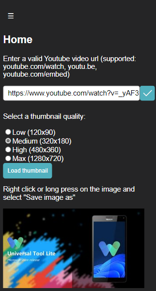

<h1>PenguinThumbnailDownloader</h1>

Download thumbnails from youtube with ease

# Features
- Open-source
- Ad-free
- Easy to use
- Most yt video urls supported (currently: youtube.com/watch, youtu.be, youtube.com/embed)

# Contribute
If you found a bug or want to suggest a feature, feel free to create an issue

If you know how to fix a bug or implement a feature, a PR would be highly appreciated

# Run locally
- Download the source code
- Extract the zip
- Open app.html with the browser of your choice

##  or

- Open a terminal and run npx serve

# Credits:
- <a href="https://www.flaticon.com/free-icons/video" title="video icons">gariebaldy from Flaticon.com for app icon</a>